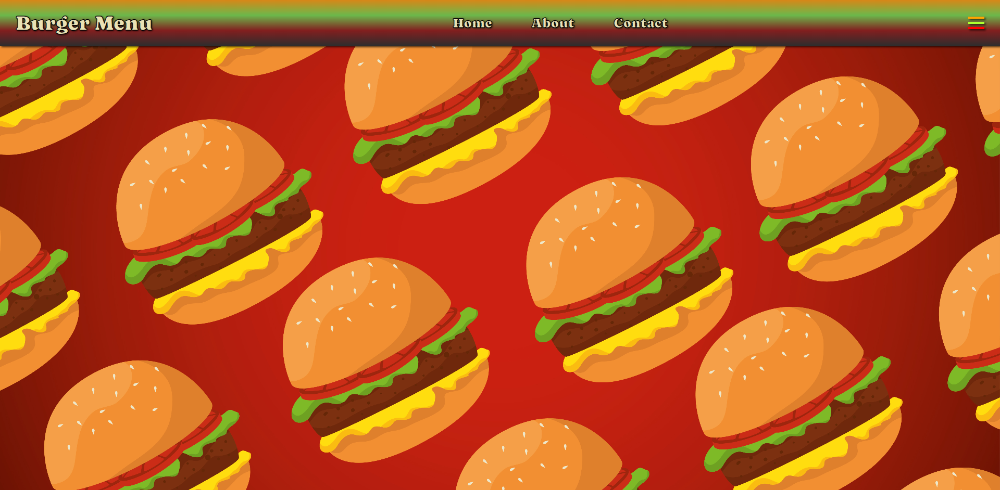
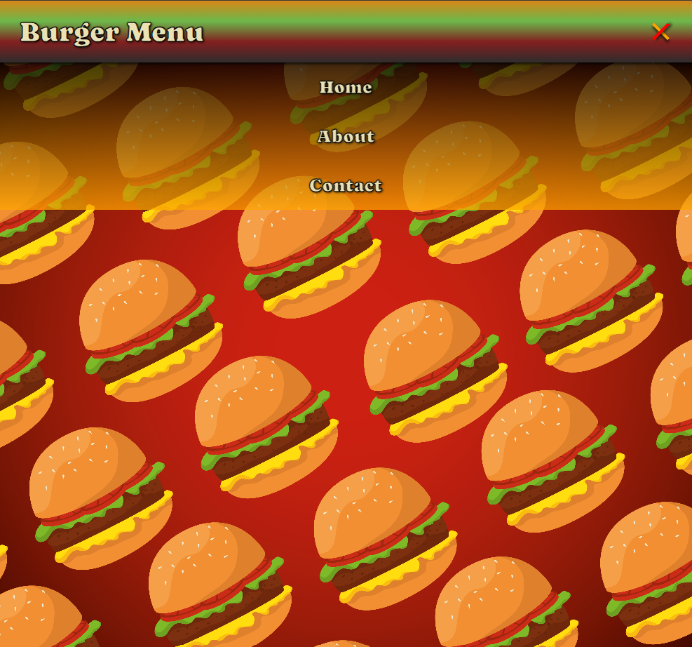

# Burger Menu

Deploy: (EM BREVE)

## Sobre

É um menu responsivo tipo "Menu Hamburguer" tematizado.

### Objetivos

Treinar minhas habilidades de HTML, CSS e JS na construção de um header responsivo focado em media queries.

### Desafio

Aprender mais sobre o responsivo para media queries e novas ferramentas do CSS.

### Conclusão

Finalizei mais este projeto básico porém de extrema relevância na criação inicial de páginas responsivas, fiquei contente com o resultado e vou continuar ampliando meus conhecimentos na criação de interatividade e visual de um menu hamburguer.

### Ferramentas Utilizadas

- HTML
- CSS
- Javascript